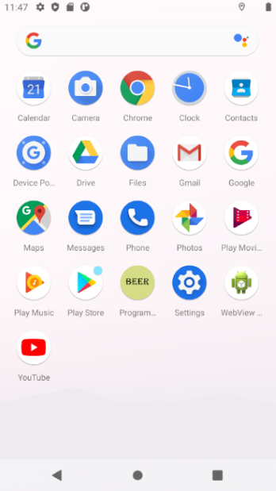
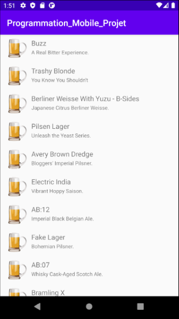
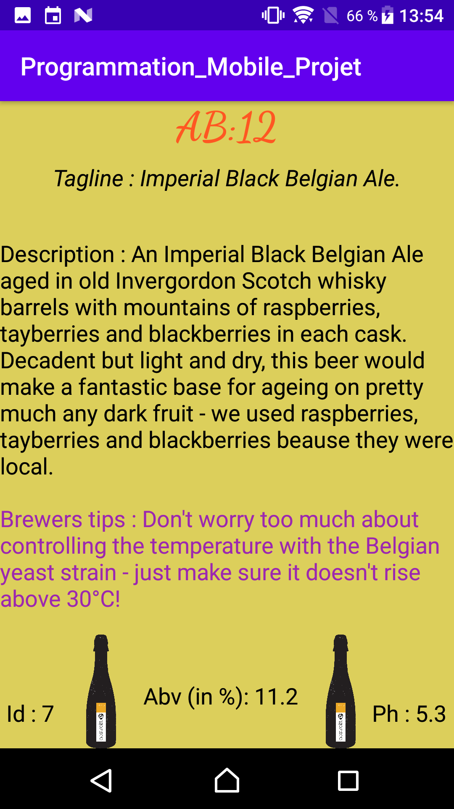
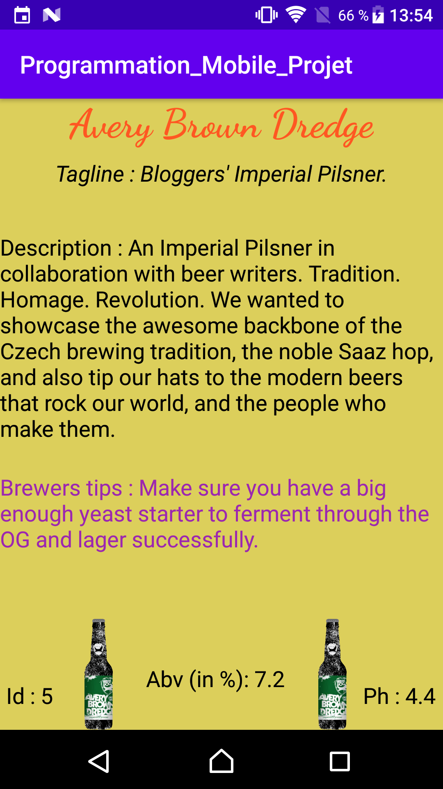

# Projet Programmation Mobile (Liste de bières)

Premier projet sur Android Studio, application qui permet d'afficher une liste de bières et d'afficher plusieurs informations sur celle-ci afin de pouvoir découvrir de nouvelles bières et passer un bon moment avant une degustation. 

## Prérequis

* Installation d'Android Studio
* Telecharger le projet sur ce lien :

```
https://github.com/luizferreira29/Programmation_Mobile_Projet_V2
```

## Consignes Respectées

* Ecran avec une liste d’éléments.
* Ecran avec le détail d’un élément.
* Appel WebService à une API Rest.
* Stockage de données en cache.
* Création d'un document du type READ_ME.
* Architecture (Utilisation des singletons, MVC, principe SOLID, ...).
* Recuperation de tout type de données dans l'API (Text, Int, Float, affichage d'image).

## Fonctionnalités :

### Icone de l'Application

* Affichage du logo de l'application



### Ecran d'accueil

* Liste de 80 bières
* Icone de bière devant chaque élément de la liste
* Nom de chaque bière
* Slogan de chaque bière



### Ecran Affichage détails

* Affichage du nom de la bière
* Affichage du slogan de la bière
* Affichage de la description de la bière
* Affichage d'une astuce de dégustation de la bière
* Affichage de l'image de la bière
* Affichage du pourcentage d'alcool
* Affichage de l'Id de la bière
* Affichage du Ph de la bière




